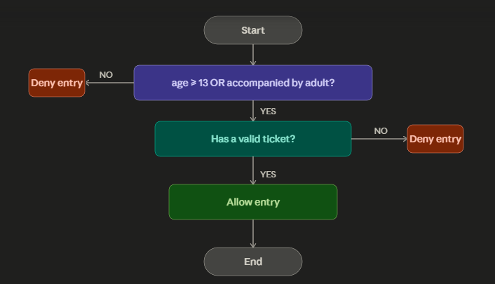

1. Identify the components

1.1 Inputs
age — the user's age (integer)
has_adult — whether the user is accompanied by an adult (boolean)
has_ticket — whether the user has a valid ticket (boolean)
1.2 Process
Evaluate the admission rule:
allowed = (age >= 13 OR has_adult) AND has_ticket

1.3 Output
A message: "Entry allowed" or "Entry denied"

2. Design the algorithm
2.1 Diagram

2.2 Truth table
A = age ≥ 13  |  B = accompanied by adult  |  T = has valid ticket

A	B	T	A OR B	(A OR B) AND T        	Result
0	0	0		1       0                   	Denied
0	0	1		1       0                   	Denied
0	1	0	  1       0                    	Denied
0	1	1	  1     	1	                    Allowed
1	0	0		1       0                    	Denied
1	0	1	  1     	1	                    Allowed
1	1	0	  1     	0	                    Denied
1	1	1	  1     	1	                    Allowed
2.3 Algorithm (step-by-step)
START
INPUT age, has_adult, has_ticket
IF (age ≥ 13 OR has_adult) THEN go to step 4, ELSE go to step 6
IF has_ticket THEN go to step 5, ELSE go to step 6
OUTPUT "Entry allowed" → go to step 7
OUTPUT "Entry denied"
END

2.4 Pseudocode
BEGIN
  INPUT age, has_adult, has_ticket

  age_ok  ← (age >= 13)
  cond1   ← (age_ok OR has_adult)
  allowed ← (cond1 AND has_ticket)

  IF allowed THEN
    OUTPUT "Entry allowed"
  ELSE
    OUTPUT "Entry denied"
  END IF
END
3. Evaluate the expression
3.1 Test with input samples
age	has_adult	has_ticket	Expected
10	False	True	Denied (too young, no adult)
10	True	True	Allowed (young but with adult + ticket)
15	False	False	Denied (old enough but no ticket)
15	False	True	Allowed (13+, has ticket)
8	True	False	Denied (with adult but no ticket)