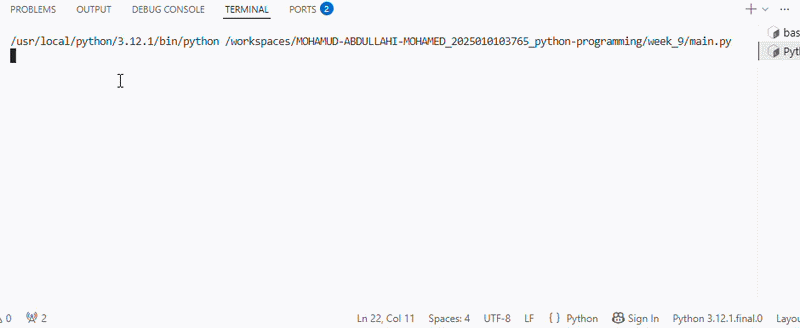

# IT Helpdesk Ticket Registration System

## Purpose

This application allows students to register IT helpdesk tickets for technical issues such as WiFi problems, password reset requests, printer malfunction, and LMS login issues.

## Tech Stack

- Python 3
- Modular Programming
- Visual Studio Code

## How to Use

1. Open the project folder.
2. Run main.py.
3. Enter:
   - Student ID
   - Student Name
   - Issue
   - Location
   - Priority
4. The system automatically assigns a technician.
5. The completed helpdesk ticket is displayed.

## Demonstration

Run:

python main.py

Example:

=== IT Helpdesk Ticket ===

Student ID : 12345678910

Student Name : abdullahi

Issue : printer

Location : library

Priority : High

======== HELPDESK TICKET ========

Student ID : 12345678910

Student : Abdullahi

Issue : blue screen pc

Location : lab101 level 1

Priority : High

Technician : Ahmad

Status : Pending

demo vedio: 